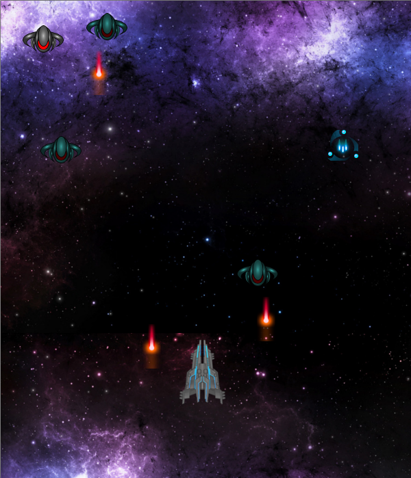

#About
This project was completed in Fall of 2014 for my Game Engineering class. This game was written in C#, using Microsoft's Visual Studio and the XNA Game Studio.

#How To Play & Story
You control the StarfighterX, a spaceship sent from Earth to an unexplored part of the Galaxy.

##Controls:
Left Key - Move Left
Right Key - Move Right
Up Key - Move Up
Down Key - Move Down
Spacebar - Shoot Laser

Enemies will be flying at you from the top of the screen,
and for every enemy you shoot, you will get 100 points added
to your score. Everytime an enemy hits you, you will lose one of
your three lives.

##Tips:
- Every now and then, a trishot Powerup will appear. While the trishot powerup is active,
you will be able to shoot 3 special laser shots that will spread in a wide range.
- Keep an eye on the one up meter. Every 10 kills will add one to your armor's health.

##Enemies:
- Rammers: These high speed enemies will try to ram you from the front. Your best bet is to destroy them or
to dodge them before they get a chance to hit you.
- Shooters: These enemies are not as fast, but they will try to shoot at you from a distance.
- Dark Guardian: These enemies spawn rarely, but should not be taken lightly. The Dark Guardians are equipped
with a strong laser attack that covers a wide range. They require 5 shots to be taken down, but provide a whopping
1000 points per kill.
